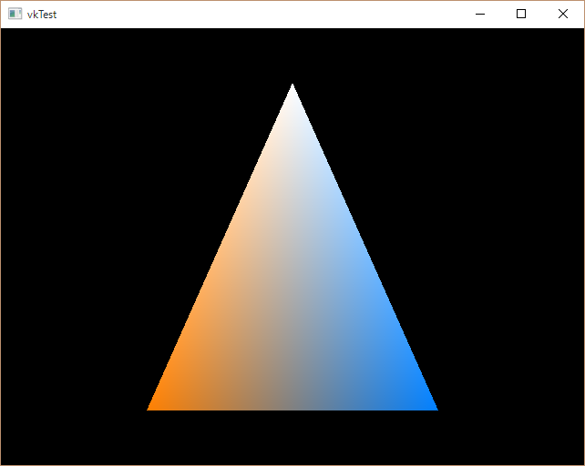

vkTest
---

Vulkan 1.0.12 with LunarG SDK on Windows 10  

To compile shader to SPIR-V bytecode, run following command.
> % glslangValidator -V -l <name>.{vert, frag} -o <name>.spv
and set extension to (vert: for Vertex Shader, frag: for Fragment Shader).

## References

- Vulkan 1.0.12 + WSI Extensions Specification
  - https://www.khronos.org/registry/vulkan/specs/1.0-wsi_extensions/xhtml/vkspec.html
- PROJECT ASURA
  - http://www.project-asura.com/program/vulkan/vulkan_001.html
  - http://www.project-asura.com/program/vulkan/vulkan_002.html
- GPUOpen
  - http://gpuopen.com/using-the-vulkan-validation-layers/
